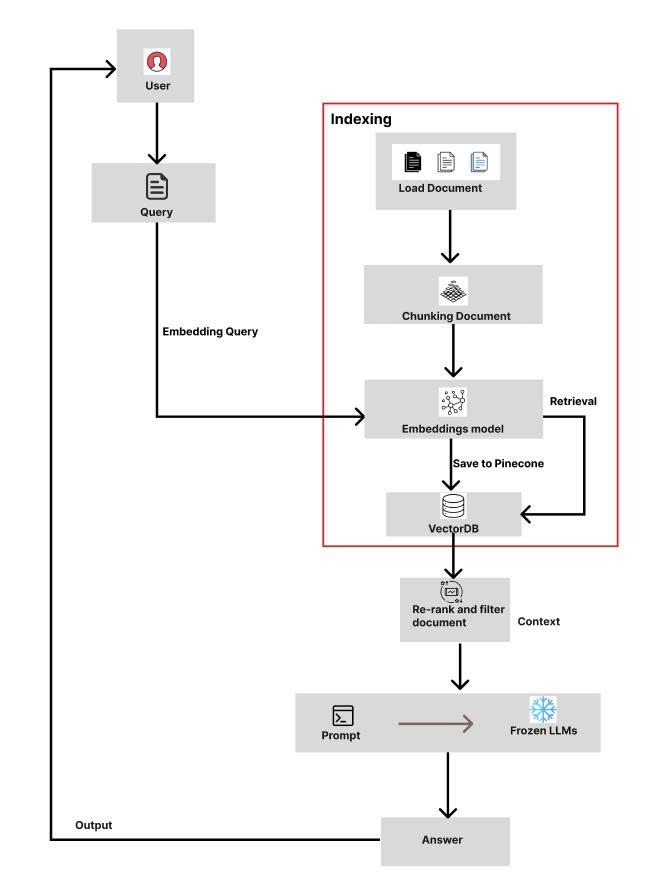

# SKINBOX - DERMATOLOGY CONSULTING CHATBOT

**Developed by: STACKLIFO TEAM**

## 1. PROJECT INTRODUCTION

### 1.1 Overview and Context

In the community today, skin issues such as acne, allergies, and dermatitis are increasingly common, directly impacting the health and mental well-being of many people. However, not everyone has the conditions to visit specialized dermatology facilities directly. Many individuals choose to self-study information or post images of their affected skin online for opinions. The information received is often inaccurate, which can even lead to serious consequences due to misdiagnosis or self-treatment.

### 1.2 Requirements and Goals

Given this reality, the project demands a technological solution to help people access accurate and safe medical information.

The specific requirement is to develop an Artificial Intelligence (AI) application capable of:

1.  Image recognition of the damaged skin area.
2.  Symptom analysis described by the user.
3.  Providing reliable preliminary advice.

The project aims to develop an intelligent support tool, enabling users to initially assess their skin condition and subsequently determine the appropriate course of action, such as self-care or consulting a specialist when necessary.

## 2. TECHNOLOGY STACK

The chatbot system leverages several advanced technologies:

| Technology                               | Role in the System                                                                                                                              |
| :--------------------------------------- | :---------------------------------------------------------------------------------------------------------------------------------------------- |
| **FLASK**                                | Serves as the deployment platform and intermediate web server between users and the core AI system.                                             |
| **RAG (Retrieval-Augmented Generation)** | Used with LangChain for Natural Language Processing (NLP), enabling the chatbot to understand context and generate accurate, natural responses. |
| **CNN (Convolutional Neural Network)**   | Analyzes skin images submitted by users to identify lesions and suggest preliminary consultation.                                               |
| **MySQL**                                | Manages the storage of user data and chat history, ensuring system stability and personalized user experience.                                  |
| **Qdrant**                               | Functions as the Vector Database (VectorDB) for storing and rapidly retrieving semantic information.                                            |
| **Selenium**                             | Used as a tool to collect the knowledge dataset from reputable medical sources.                                                                 |

## 3. SYSTEM ARCHITECTURE AND PERFORMANCE

### 3.1 Architecture

The system is designed with two primary processing flows:

1.  **Image Processing Flow (CNN):** Analyzes user-uploaded skin images to identify pathological features.
2.  **Text Processing Flow (RAG):** Analyzes user-described symptoms and retrieves information from the knowledge base.

The diagram below illustrates the RAG architecture used for the text processing flow:


_(Note: The diagram uses "Pinecone" as an example VectorDB. This project uses "Qdrant" in the equivalent role.)_

### 3.2 Key Results and Performance

- **CNN Model Training Accuracy:** The accuracy reached **71.5%**.
- **Dataset:** The CNN model was trained on a dataset containing **272,000 images** covering **10 disease labels**.

### 3.3 Product Interfaces

The developed graphical user interfaces (GUIs) include:

1.  Login and Registration Interface
2.  Homepage Interface
3.  Chatbot Interface
4.  Contribution Page Interface

_(Recommended: Insert screenshots of your application here, e.g., `[screenshot_chat.png]`)_

## 4. GETTING STARTED

This guide will get you a copy of the project up and running on your local machine for development and testing purposes.

### 4.1 Prerequisites

Ensure you have the following software installed:

- Python `[e.g., 3.10+]`
- MySQL Server `[e.g., 8.0+]`
- Qdrant (running as a service or Docker container)
- Git

### 4.2 Installation

1.  **Clone the repository:**

    ```bash
    git clone [your-repository-url.git]
    cd [your-project-directory]
    ```

2.  **Create and activate a virtual environment (Recommended):**

    ```bash
    # For macOS/Linux
    python3 -m venv venv
    source venv/bin/activate

    # For Windows
    python -m venv venv
    .\venv\Scripts\activate
    ```

3.  **Install the required packages:**
    ```bash
    pip install -r requirements.txt
    ```

### 4.3 Configuration

1.  **Database Setup:**

    - Access your MySQL server and create a new database for the project.
    - Example: `CREATE DATABASE skinbox_db;`

2.  **Environment Variables:**

    - Create a `.env` file in the root directory of the project.
    - Copy the contents from `.env.example` (if it exists) or add the necessary variables.

    **Example `.env` file:**

    ```ini
    # Flask Configuration
    FLASK_APP=app.py
    FLASK_ENV=development
    SECRET_KEY=[your-very-long-random-secret-key]

    # Database Configuration
    DB_HOST=localhost
    DB_USER=root
    DB_PASSWORD=[your-mysql-password]
    DB_NAME=skinbox_db

    # Qdrant Configuration
    QDRANT_HOST=localhost
    QDRANT_PORT=6333
    ```

### 4.4 Running the Application

1.  **Run the Flask web server:**

    ```bash
    flask run
    ```

    Or:

    ```bash
    python app.py
    ```

    The application will be accessible at `http://127.0.0.1:5000`.

2.  **Run other scripts (if applicable):**
    - To run the Selenium data crawler:
      ```bash
      python run_selenium_crawler.py
      ```
    - To retrain the CNN model:
      ```bash
      python train_model.py
      ```

## 5. DEVELOPMENT TEAM

The project was executed by the **STACKLIFO TEAM**:

| Name           | Role        |
| :------------- | :---------- |
| Trần Thế Anh   | AI Engineer |
| Nguyễn Văn Bảo | Developer   |
| Võ Duy Khang   | Developer   |

Report link  ---> <a href="https://www.canva.com/design/DAG2gWPjMQc/uyVuAkuW2Ub2_-nl3FJDdw/edit"> PRESS ME</a>


